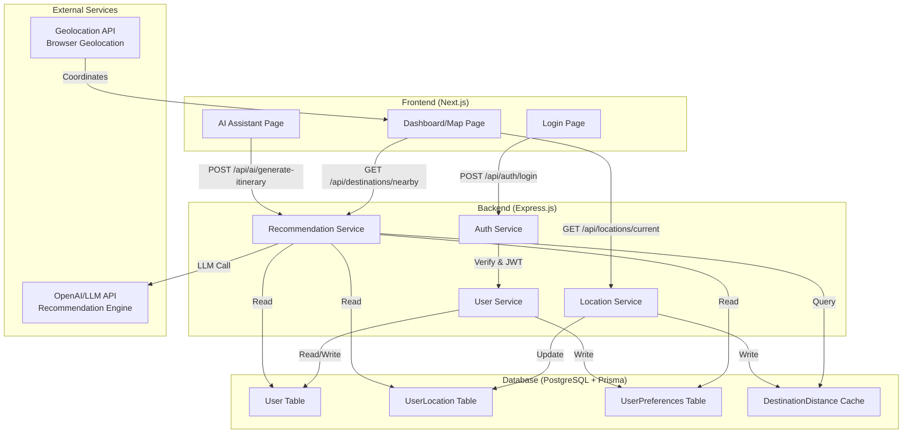
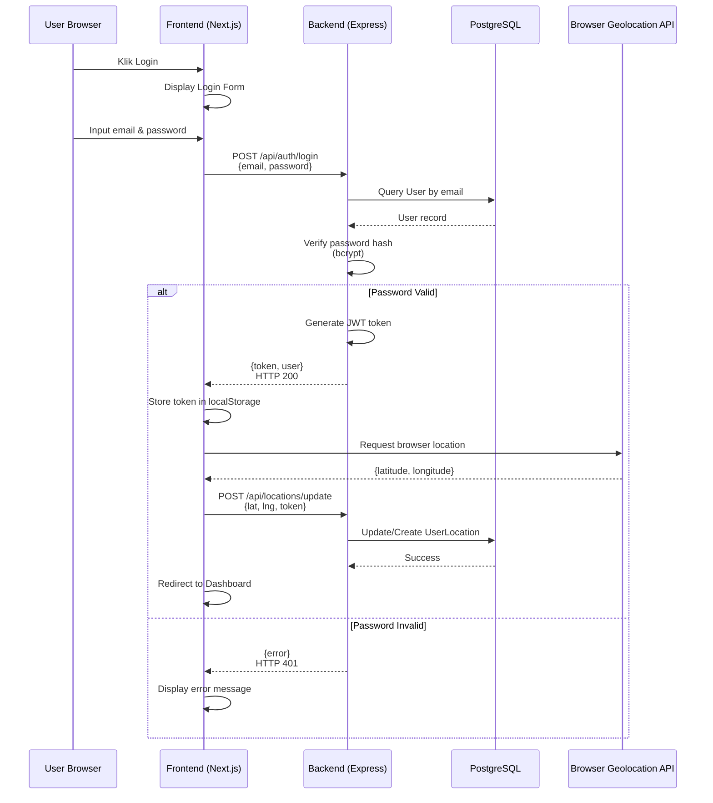
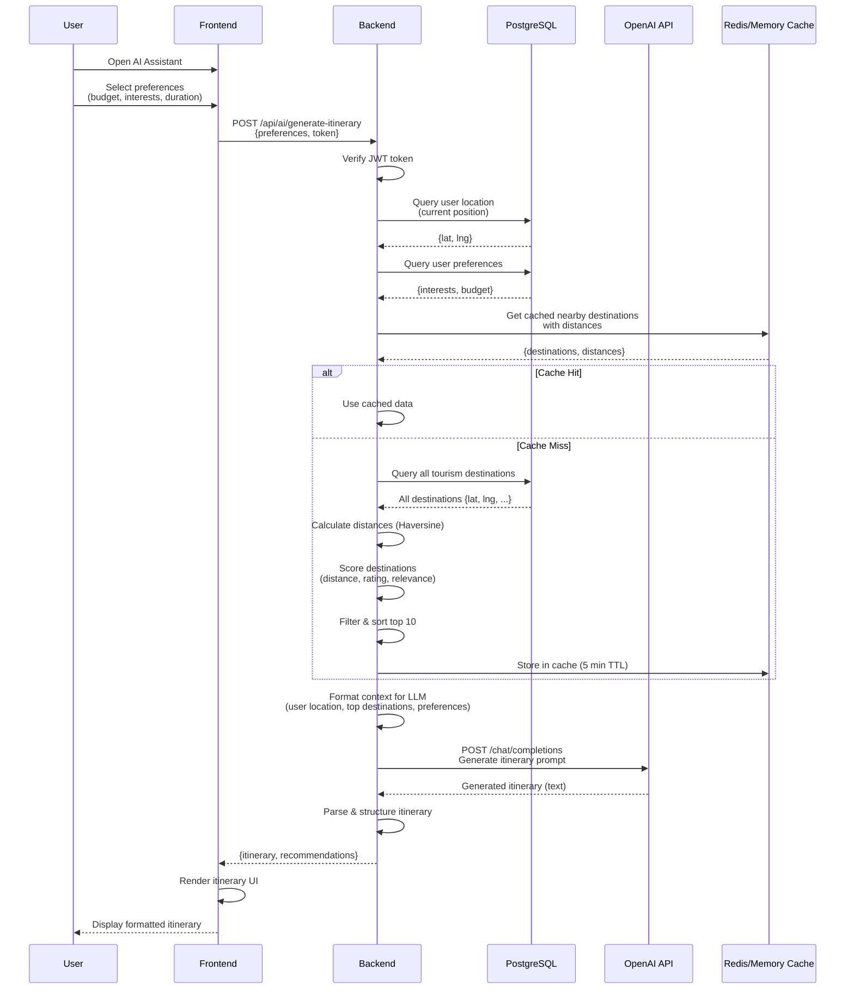

# Design Document: Login & User Management, Smart Map Integration, AI Assistant Recommendation

## Overview

Dokumen ini merupakan desain teknis lengkap untuk tiga fitur utama aplikasi Magelang:

1. **Sistem Login & User Management** - Autentikasi pengguna dengan JWT, penyimpanan data user terenkripsi di PostgreSQL
2. **Smart Map Integration** - Integrasi lokasi real-time pengguna dengan Leaflet.js, perhitungan jarak hingga destinasi wisata
3. **AI Assistant Recommendation Engine** - Generasi itinerary berbasis lokasi, preferensi pengguna, dan algoritma proximity-based dengan scoring

Ketiga fitur ini terintegrasi seamless: pengguna login → sistem menangkap lokasi real-time → AI memberikan rekomendasi destinasi berdasarkan jarak dan preferensi.

## Design Decision Log

Berdasarkan review, keputusan desain berikut telah ditetapkan:

| Aspek             | Keputusan                       | Alasan                                                                  |
| ----------------- | ------------------------------- | ----------------------------------------------------------------------- |
| AI Engine         | OpenAI GPT-4 API                | High quality itinerary generation dengan natural language understanding |
| Caching           | Redis                           | Distributed, scalable, TTL management untuk distance cache              |
| JWT Storage       | httpOnly Cookies                | XSS protection, secure token transmission                               |
| Location Tracking | Hybrid (On-demand + Background) | Balance antara accuracy dan battery drain optimization                  |
| Data Deletion     | Soft Delete + FK Cascade        | Maintain audit trail sambil preserve referential integrity              |
| Destination Data  | Admin-Only Modifications        | Data quality control, community reviews allowed                         |

## Architecture



## Sequence Diagrams

### Sequence: User Login & Initialize Location



### Sequence: Generate AI Itinerary with Location-Based Recommendations



## Components and Interfaces

### 1. Authentication & User Management

#### Component: AuthService

**Purpose**: Mengelola login, JWT token generation, password hashing, dan session management.

**Interface**:

```typescript
interface AuthService {
  // Login pengguna dengan email dan password
  login(
    email: string,
    password: string
  ): Promise<{
    token: string;
    user: User;
    expiresIn: number;
  }>;

  // Register pengguna baru
  register(data: { email: string; password: string; name: string }): Promise<{
    token: string;
    user: User;
  }>;

  // Verifikasi JWT token
  verifyToken(token: string): Promise<{
    userId: string;
    email: string;
    iat: number;
    exp: number;
  }>;

  // Refresh token yang expired
  refreshToken(token: string): Promise<{
    token: string;
    expiresIn: number;
  }>;

  // Logout (invalidate token)
  logout(token: string): Promise<void>;
}
```

**Responsibilities**:

- Password hashing dengan bcrypt (min 10 rounds)
- JWT token generation dengan RS256 (asymmetric)
- Token expiration (15 min access, 7 days refresh)
- Rate limiting pada login endpoint (5 attempts/15 min per IP)
- Secure password storage

#### Component: UserService

**Purpose**: Mengelola user data, preferences, dan profile information.

**Interface**:

```typescript
interface UserService {
  // Get user by ID
  getUserById(userId: string): Promise<User>;

  // Update user profile
  updateProfile(
    userId: string,
    data: {
      name?: string;
      avatar?: string;
      bio?: string;
    }
  ): Promise<User>;

  // Get user preferences
  getUserPreferences(userId: string): Promise<UserPreferences>;

  // Update user preferences (interests, budget level, etc)
  updatePreferences(
    userId: string,
    data: {
      interests: string[];
      budgetLevel: 'budget' | 'moderate' | 'premium';
      mobilityLevel: number; // 1-10 (1=no mobility, 10=full)
      language: string;
    }
  ): Promise<UserPreferences>;

  // Check if email already exists
  emailExists(email: string): Promise<boolean>;

  // Delete user account
  deleteUser(userId: string): Promise<void>;
}
```

**Responsibilities**:

- CRUD operations untuk user profile
- Preferences management
- Email validation
- Account deletion dengan cascade rules

### 2. Location & Map Integration

#### Component: LocationService

**Purpose**: Menangkap lokasi real-time pengguna, menyimpan history, dan menyediakan data lokasi.

**Interface**:

```typescript
interface LocationService {
  // Update atau create lokasi user terbaru
  updateUserLocation(
    userId: string,
    data: {
      latitude: number;
      longitude: number;
      accuracy?: number;
      timestamp?: Date;
    }
  ): Promise<UserLocation>;

  // Get lokasi terakhir user
  getCurrentLocation(userId: string): Promise<UserLocation>;

  // Get location history
  getLocationHistory(userId: string, limit: number = 50): Promise<UserLocation[]>;

  // Calculate distance between two coordinates (Haversine)
  calculateDistance(lat1: number, lng1: number, lat2: number, lng2: number): number; // returns km

  // Get nearby destinations from user location
  getNearbyDestinations(
    userId: string,
    radius: number = 5 // km
  ): Promise<
    Array<{
      destination: Tourism;
      distance: number; // km
      estimatedTravelTime: number; // minutes
    }>
  >;
}
```

**Responsibilities**:

- Geolocation data capture dari browser
- Penyimpanan location history
- Perhitungan jarak real-time
- Privacy: anonymization after 30 days
- Location accuracy validation

#### Component: MapIntegrationComponent (Frontend)

**Purpose**: Render Leaflet.js map dengan user position, nearby destinations, dan routing.

**Interface**:

```typescript
interface MapIntegrationComponent {
  // Initialize map with center coordinates
  initializeMap(
    center: {
      lat: number;
      lng: number;
    },
    zoom: number
  ): void;

  // Add user position marker (blue dot)
  addUserMarker(
    position: {
      lat: number;
      lng: number;
    },
    accuracy?: number
  ): void;

  // Add destination markers dengan popup info
  addDestinationMarkers(destinations: Tourism[]): void;

  // Draw route from user to destination
  drawRoute(
    from: { lat: number; lng: number },
    to: { lat: number; lng: number },
    routeType: 'driving' | 'walking' | 'transit'
  ): void;

  // Update user position in real-time
  updateUserPosition(position: { lat: number; lng: number }): void;

  // Get clicked destination data
  onDestinationClick(callback: (destination: Tourism) => void): void;

  // Show distance and travel time
  displayMetrics(destination: Tourism): void;
}
```

**Responsibilities**:

- Real-time map rendering
- Marker management
- Click/tap interaction
- Distance visualization
- Responsive design

### 3. AI Recommendation Engine

#### Component: RecommendationService

**Purpose**: Generate rekomendasi destinasi berbasis AI dengan proximity scoring dan preference matching.

**Interface**:

```typescript
interface RecommendationService {
  // Generate ranked recommendations based on user location & preferences
  getRecommendations(
    userId: string,
    options: {
      maxDistance?: number; // km
      limit?: number;
      filters?: {
        category?: string[];
        priceRange?: string[];
        ratings?: number; // min rating
      };
    }
  ): Promise<
    Array<{
      destination: Tourism;
      score: number; // 0-100
      distance: number;
      reason: string;
      estimatedTravelTime: number;
    }>
  >;

  // Generate full itinerary with time allocation
  generateItinerary(
    userId: string,
    params: {
      duration: number; // hours
      startTime: Date;
      preferences: string[];
      budget: 'budget' | 'moderate' | 'premium';
    }
  ): Promise<{
    itinerary: ItineraryItem[];
    totalDistance: number;
    totalCost: number;
    summary: string;
  }>;

  // Get AI-generated insights and tips
  getAIInsights(
    userId: string,
    destinationId: string
  ): Promise<{
    tips: string[];
    bestTimeToVisit: string;
    localRecommendations: string[];
  }>;
}
```

**Responsibilities**:

- Proximity-based scoring
- Preference matching algorithm
- Cost estimation
- Time allocation optimization
- LLM integration untuk natural language generation

## Data Models

### Model 1: User

```typescript
interface User {
  id: string; // CUID
  email: string; // unique, indexed
  passwordHash: string; // bcrypt hashed
  name: string;
  avatar?: string;
  bio?: string;

  // Account meta
  createdAt: Date;
  updatedAt: Date;
  lastLogin: Date;

  // Account status
  isVerified: boolean; // email verification
  isActive: boolean; // soft delete

  // Relations
  preferences: UserPreferences;
  locations: UserLocation[];
  savedItineraries: SavedItinerary[];
}
```

**Validation Rules**:

- Email must be valid RFC 5322 format
- Password minimum 8 chars, must include uppercase, lowercase, number, special char
- Name must be 2-100 characters
- Email must be unique across database

### Model 2: UserLocation

```typescript
interface UserLocation {
  id: string;
  userId: string; // FK to User
  latitude: number; // -90 to 90
  longitude: number; // -180 to 180
  accuracy?: number; // meters (from browser)
  altitude?: number; // meters
  speed?: number; // km/h

  timestamp: Date;
  createdAt: Date;

  // Meta
  source: 'gps' | 'wifi' | 'manual';
  deviceId?: string;
}
```

**Validation Rules**:

- Latitude harus valid geographic coordinate
- Longitude harus valid geographic coordinate
- Accuracy harus >= 0
- Timestamp harus dalam timezone UTC
- One latest location per user (update or create)

### Model 3: UserPreferences

```typescript
interface UserPreferences {
  id: string;
  userId: string; // FK to User, unique

  // Interests
  interests: string[]; // ['nature', 'culture', 'food', 'history', 'adventure']

  // Budget
  budgetLevel: 'budget' | 'moderate' | 'premium';
  maxSpendPerDay: number; // in currency

  // Mobility & Accessibility
  mobilityLevel: number; // 1-10 (1=wheelchair, 10=full hiking)
  hasChildrenInGroup: boolean;
  childrenAges?: number[];

  // Preferences
  language: string; // 'id', 'en'
  distancePreference: number; // max km per day

  createdAt: Date;
  updatedAt: Date;
}
```

**Validation Rules**:

- Interests harus dari predefined list
- budgetLevel harus enum value
- mobilityLevel harus 1-10
- maxSpendPerDay harus >= 0
- distancePreference harus >= 0
- One preferences record per user

### Model 4: SavedItinerary

```typescript
interface SavedItinerary {
  id: string;
  userId: string; // FK to User
  title: string;
  description?: string;

  // Itinerary content
  items: ItineraryItem[]; // JSON stored
  duration: number; // hours
  totalDistance: number; // km
  totalEstimatedCost: number;

  // Meta
  generatedAt: Date;
  createdAt: Date;

  // Status
  isCompleted: boolean;
  completedAt?: Date;
  rating?: number; // 1-5
  feedback?: string;
}
```

**Validation Rules**:

- title must be 3-200 characters
- items array must have at least 2 items
- duration > 0
- totalDistance >= 0

## Algorithmic Pseudocode

### Algorithm 1: Proximity-Based Destination Scoring

```pascal
ALGORITHM scoreDestinationsByProximity(userLocation, destinations, userPreferences)
  INPUT:
    userLocation = {lat, lng}
    destinations = [{id, name, category, rating, lat, lng}, ...]
    userPreferences = {interests, budgetLevel, mobilityLevel}
  OUTPUT:
    rankedDestinations = [{destination, score, distance}, ...]

BEGIN
  // Initialize scoring components
  scoredDestinations ← empty list

  // Calculate max relevance distance (based on mobilityLevel)
  maxRelevantDistance ← calculateMaxDistance(userPreferences.mobilityLevel)

  // Score each destination
  FOR each destination IN destinations DO
    // Step 1: Calculate raw distance
    distance ← haversineDistance(userLocation, {destination.lat, destination.lng})

    // Step 2: Filter out unreachable destinations
    IF distance > maxRelevantDistance THEN
      CONTINUE // Skip this destination
    END IF

    // Step 3: Distance score (closer = higher, 0-30 points)
    distanceScore ← 30 * (1 - (distance / maxRelevantDistance))

    // Step 4: Category relevance score (0-35 points)
    categoryRelevance ← 0
    FOR each interest IN userPreferences.interests DO
      IF destination.category EQUALS interest THEN
        categoryRelevance ← 35
        BREAK
      END IF
    END FOR

    // Step 5: Rating score (0-20 points)
    ratingScore ← (destination.rating / 5.0) * 20

    // Step 6: Budget compatibility score (0-15 points)
    budgetScore ← calculateBudgetScore(destination.priceRange, userPreferences.budgetLevel)

    // Step 7: Accessibility score based on mobility level (0-10 points)
    accessibilityScore ← evaluateAccessibility(destination, userPreferences.mobilityLevel)

    // Step 8: Calculate total score
    totalScore ← distanceScore + categoryRelevance + ratingScore + budgetScore + accessibilityScore

    // Add to results
    scoredDestinations.add({
      destination: destination,
      score: totalScore,
      distance: distance,
      breakdown: {
        distanceScore: distanceScore,
        categoryRelevance: categoryRelevance,
        ratingScore: ratingScore,
        budgetScore: budgetScore,
        accessibilityScore: accessibilityScore
      }
    })
  END FOR

  // Sort by score descending
  SORT scoredDestinations BY score DESCENDING

  RETURN scoredDestinations
END ALGORITHM
```

**Preconditions**:

- userLocation has valid latitude (-90 to 90) and longitude (-180 to 180)
- destinations array is non-empty
- userPreferences are properly validated
- mobilityLevel is between 1-10

**Postconditions**:

- All returned destinations have distance <= maxRelevantDistance
- Results sorted by total score (highest first)
- Score values are between 0-100
- All destination objects are unmodified

**Loop Invariants**:

- For each iteration: current destination is evaluated with same criteria
- All processed destinations have valid distance calculations
- Score components always positive and within bounds

### Algorithm 2: Itinerary Generation with Time Allocation

```pascal
ALGORITHM generateOptimalItinerary(userLocation, recommendations, duration, constraints)
  INPUT:
    userLocation = {lat, lng}
    recommendations = [{destination, distance, travelTime, duration_min}, ...]
    duration = total time available in hours
    constraints = {startTime, budget, preferences}
  OUTPUT:
    itinerary = [{destination, startTime, endTime, travelTime, notes}, ...]

BEGIN
  // Initialize algorithm
  itinerary ← empty list
  currentLocation ← userLocation
  currentTime ← constraints.startTime
  remainingTime ← duration * 60 // convert to minutes
  remainingBudget ← constraints.budget
  selectedDestinations ← empty list

  // Sort recommendations by score (already sorted from scoring algorithm)
  SORT recommendations BY score DESCENDING

  // Greedy algorithm: select destinations that fit in time and budget
  FOR each recommendation IN recommendations DO
    // Skip if no time left
    IF remainingTime < 30 THEN // minimum 30 min per destination
      BREAK
    END IF

    // Calculate required time: travel + stay
    travelTime ← recommendation.travelTime
    stayTime ← MIN(120, remainingTime - travelTime) // max 2 hours per destination
    totalTime ← travelTime + stayTime

    // Check if fits in remaining time
    IF totalTime > remainingTime THEN
      CONTINUE
    END IF

    // Estimate cost
    estimatedCost ← recommendation.destination.averageCost + (travelTime / 60) * TRANSPORT_COST

    // Check if fits budget
    IF estimatedCost > remainingBudget THEN
      CONTINUE
    END IF

    // Add to itinerary
    item ← {
      destination: recommendation.destination,
      distance: recommendation.distance,
      startTime: currentTime,
      endTime: currentTime + totalTime minutes,
      travelTime: travelTime,
      stayTime: stayTime,
      estimatedCost: estimatedCost
    }
    itinerary.add(item)

    // Update state
    selectedDestinations.add(recommendation.destination)
    currentLocation ← recommendation.destination location
    currentTime ← currentTime + totalTime minutes
    remainingTime ← remainingTime - totalTime
    remainingBudget ← remainingBudget - estimatedCost
  END FOR

  // If too few destinations (< 2), try to add more with relaxed constraints
  IF length(itinerary) < 2 THEN
    FOR each recommendation IN recommendations DO
      IF recommendation.destination NOT IN selectedDestinations THEN
        // Attempt to squeeze in with minimal time
        IF remainingTime >= 30 AND remainingBudget > 0 THEN
          item ← create itinerary item with 30 min stay
          itinerary.add(item)
          remainingTime ← remainingTime - 30
        END IF
      END IF
    END FOR
  END IF

  // Validate and add travel notes
  FOR i = 0 TO length(itinerary) - 1 DO
    itinerary[i].notes ← generateTravelNotes(itinerary[i])
  END FOR

  RETURN itinerary
END ALGORITHM
```

**Preconditions**:

- userLocation is valid coordinate
- recommendations array is sorted by score descending
- duration > 0
- startTime is valid Date
- budget >= 0

**Postconditions**:

- Itinerary items are chronologically ordered
- Total duration of itinerary <= requested duration
- Total cost <= budget
- Each item has travel time > 0 and stay time >= 30 minutes
- No overlapping time slots

**Loop Invariants**:

- remainingTime decreases with each iteration
- remainingBudget decreases with each iteration
- currentTime always increases
- All selected destinations are unique (no duplicates)

### Algorithm 3: Haversine Distance Calculation

```pascal
ALGORITHM haversineDistance(point1, point2)
  INPUT:
    point1 = {lat1, lng1} in degrees
    point2 = {lat2, lng2} in degrees
  OUTPUT:
    distance in kilometers

BEGIN
  // Constants
  EARTH_RADIUS_KM ← 6371

  // Convert degrees to radians
  lat1_rad ← point1.lat * π / 180
  lng1_rad ← point1.lng * π / 180
  lat2_rad ← point2.lat * π / 180
  lng2_rad ← point2.lng * π / 180

  // Calculate deltas
  Δlat ← lat2_rad - lat1_rad
  Δlng ← lng2_rad - lng1_rad

  // Haversine formula
  a ← sin²(Δlat/2) + cos(lat1_rad) * cos(lat2_rad) * sin²(Δlng/2)
  c ← 2 * arcsin(√a)

  distance ← EARTH_RADIUS_KM * c

  RETURN distance
END ALGORITHM
```

**Preconditions**:

- lat1, lat2 must be in range [-90, 90]
- lng1, lng2 must be in range [-180, 180]

**Postconditions**:

- distance >= 0
- distance is in kilometers with precision to 0.01 km

## Key Functions with Formal Specifications

### Function 1: authenticate()

```typescript
function authenticate(
  email: string,
  password: string
): Promise<{
  token: string;
  user: User;
  expiresIn: number;
}>;
```

**Preconditions**:

- `email` is non-empty string and valid email format
- `password` is non-empty string
- User with given email exists in database
- Password is not empty

**Postconditions**:

- Returns object with JWT token if authentication successful
- token contains userId, email, and exp claim
- User object returned without passwordHash
- If password invalid: throws UnauthorizedError
- No mutations to User object

**Error Handling**:

- InvalidEmailFormat: email doesn't match RFC 5322
- UserNotFound: email not in database
- IncorrectPassword: password hash doesn't match
- TooManyAttempts: rate limit exceeded

### Function 2: updateUserLocation()

```typescript
function updateUserLocation(
  userId: string,
  location: {
    latitude: number;
    longitude: number;
    accuracy?: number;
  }
): Promise<UserLocation>;
```

**Preconditions**:

- `userId` exists and is valid CUID
- `latitude` in range [-90, 90]
- `longitude` in range [-180, 180]
- `accuracy` >= 0 if provided
- User is authenticated

**Postconditions**:

- New UserLocation record created with current timestamp
- Previous location record for user unchanged
- Returns created/updated UserLocation object
- Geolocation data persisted to database

**Validation**:

- Coordinates must be within geographic bounds
- Accuracy must be positive or zero
- Timestamp always set to current UTC time

### Function 3: scoreDestinations()

```typescript
function scoreDestinations(
  userLocation: { latitude: number; longitude: number },
  destinations: Tourism[],
  preferences: UserPreferences,
  maxResults?: number
): Array<{
  destination: Tourism;
  score: number;
  distance: number;
}>;
```

**Preconditions**:

- `userLocation` has valid lat/lng coordinates
- `destinations` array is non-empty
- `preferences` object is validated
- `maxResults` > 0 if provided

**Postconditions**:

- Returns array of scored destinations sorted by score descending
- Array length <= min(destinations.length, maxResults)
- All scores between 0-100
- All distances >= 0 and <= maxDistance from preferences
- No destination appears twice in results
- Original destinations array unchanged

**Score Calculation**:

- Distance component (0-30): inverse distance relationship
- Category relevance (0-35): exact match gets 35, no match gets 0
- Rating component (0-20): proportional to destination.rating/5
- Budget component (0-15): based on preference compatibility
- Accessibility (0-10): based on mobility level

### Function 4: generateItinerary()

```typescript
function generateItinerary(
  userId: string,
  params: {
    duration: number;
    startTime: Date;
    interests: string[];
    budget: number;
  }
): Promise<{
  itinerary: ItineraryItem[];
  totalDistance: number;
  totalCost: number;
  summary: string;
}>;
```

**Preconditions**:

- `userId` exists and user is authenticated
- `duration` > 0 (in hours)
- `startTime` is valid Date in future
- `interests` array is non-empty
- `budget` > 0

**Postconditions**:

- Returns itinerary with 2-6 destinations (based on time availability)
- Total duration of activities <= requested duration
- Total cost <= budget
- All items are chronologically ordered
- No overlapping time slots
- Recommendation quality score embedded in summary

**Error Handling**:

- InsufficientTime: cannot fit minimum 2 destinations
- NoBudgetAvailable: no destinations within budget
- NoDestinationsMatching: no destinations match interests

## Example Usage

### Example 1: User Login and Location Initialization

```typescript
// Frontend - Login page
const loginUser = async (email: string, password: string) => {
  try {
    const response = await fetch('/api/auth/login', {
      method: 'POST',
      headers: { 'Content-Type': 'application/json' },
      body: JSON.stringify({ email, password }),
    });

    if (!response.ok) throw new Error('Login failed');

    const { token, user } = await response.json();

    // Store token
    localStorage.setItem('authToken', token);

    // Get user location
    const position = await new Promise((resolve, reject) => {
      navigator.geolocation.getCurrentPosition(resolve, reject, {
        enableHighAccuracy: true,
        timeout: 10000,
        maximumAge: 0,
      });
    });

    // Update location on backend
    await fetch('/api/locations/update', {
      method: 'POST',
      headers: {
        'Content-Type': 'application/json',
        Authorization: `Bearer ${token}`,
      },
      body: JSON.stringify({
        latitude: position.coords.latitude,
        longitude: position.coords.longitude,
        accuracy: position.coords.accuracy,
      }),
    });

    // Navigate to dashboard
    router.push('/smart-map');
  } catch (error) {
    console.error('Login error:', error);
  }
};
```

### Example 2: Display Map with User and Destinations

```typescript
// Frontend - Smart Map component
const SmartMap = () => {
  const [destinations, setDestinations] = useState<any[]>([]);
  const mapRef = useRef<any>(null);

  useEffect(() => {
    // Initialize map
    const map = L.map(mapRef.current).setView([7.4728, 110.2122], 13);
    L.tileLayer('https://{s}.tile.openstreetmap.org/{z}/{x}/{y}.png').addTo(map);

    // Get user location and nearby destinations
    const token = localStorage.getItem('authToken');

    navigator.geolocation.watchPosition(async (position) => {
      const { latitude, longitude } = position.coords;

      // Add user marker
      L.circleMarker([latitude, longitude], {
        radius: 8,
        color: '#00BFFF',
        weight: 2,
        opacity: 1,
        fillOpacity: 0.8
      }).addTo(map);

      // Fetch nearby destinations
      const response = await fetch('/api/destinations/nearby', {
        headers: { 'Authorization': `Bearer ${token}` }
      });

      const nearby = await response.json();
      setDestinations(nearby);

      // Add destination markers
      nearby.forEach((item: any) => {
        L.marker([item.destination.latitude, item.destination.longitude])
          .bindPopup(`
            <b>${item.destination.name}</b><br/>
            Distance: ${item.distance.toFixed(2)} km<br/>
            Travel Time: ~${item.estimatedTravelTime} min
          `)
          .addTo(map);
      });
    });
  }, []);

  return <div ref={mapRef} style={{ width: '100%', height: '600px' }} />;
};
```

### Example 3: Generate AI Itinerary

```typescript
// Frontend - AI Assistant component
const generateItinerary = async (preferences: {
  duration: number;
  interests: string[];
  budget: number;
}) => {
  const token = localStorage.getItem('authToken');

  try {
    const response = await fetch('/api/ai/generate-itinerary', {
      method: 'POST',
      headers: {
        'Content-Type': 'application/json',
        Authorization: `Bearer ${token}`,
      },
      body: JSON.stringify({
        duration: preferences.duration,
        startTime: new Date().toISOString(),
        interests: preferences.interests,
        budget: preferences.budget,
      }),
    });

    const { itinerary, totalCost, summary } = await response.json();

    // Display itinerary
    console.log('Generated Itinerary:');
    itinerary.forEach((item: any, idx: number) => {
      console.log(`${idx + 1}. ${item.destination.name}`);
      console.log(`   Start: ${new Date(item.startTime).toLocaleTimeString()}`);
      console.log(`   Duration: ${item.stayTime} minutes`);
      console.log(`   Cost: ${item.estimatedCost}`);
    });

    console.log(`\nTotal Cost: ${totalCost}`);
    console.log(`Summary: ${summary}`);
  } catch (error) {
    console.error('Error generating itinerary:', error);
  }
};
```

## Correctness Properties

### Property 1: Authentication Security

**Universal Statement**:

```
∀ user ∈ User, password ∈ String :
  authenticate(email=user.email, password) = Success(token)
  ⟺ bcrypt.verify(password, user.passwordHash) = true
```

This property ensures that successful authentication only occurs when password hash verification succeeds. Password must never be stored in plain text.

### Property 2: Distance Calculation Accuracy

**Universal Statement**:

```
∀ point1, point2 ∈ Coordinates :
  distance = haversineDistance(point1, point2)
  ∧ distance_reverse = haversineDistance(point2, point1)
  ⟹ distance = distance_reverse (within ±0.01 km)
```

This property ensures the distance calculation is symmetric and mathematically sound using the Haversine formula.

### Property 3: Itinerary Feasibility

**Universal Statement**:

```
∀ itinerary ∈ GeneratedItinerary :
  sum(duration of all items) ≤ requested_duration
  ∧ sum(cost of all items) ≤ budget
  ∧ no overlapping time slots
  ∧ chronological order maintained
```

This property ensures generated itineraries always fit within time and budget constraints.

### Property 4: Location Privacy

**Universal Statement**:

```
∀ location ∈ UserLocation, retention_period = 30 days :
  current_time - location.timestamp > retention_period
  ⟹ location must be anonymized or deleted
```

This property ensures user location data is not retained indefinitely.

### Property 5: Destination Scoring Consistency

**Universal Statement**:

```
∀ destination1, destination2 ∈ Destinations :
  score(destination1) > score(destination2)
  ⟹ probability of user interest in destination1 > destination2
```

This property ensures higher scores correlate with actual user preference match.

## Error Handling

### Error Scenario 1: Invalid Credentials

**Condition**: User inputs wrong email or password
**Response**: HTTP 401 Unauthorized with message "Invalid email or password"
**Recovery**:

- Increment failed attempt counter
- After 5 failed attempts in 15 minutes: lock account for 15 min
- Send security alert email
- User can reset password via email link

### Error Scenario 2: Location Permission Denied

**Condition**: Browser geolocation API returns permission denied
**Response**: HTTP 403 Forbidden with message "Location permission required"
**Recovery**:

- Display UI prompt to enable location in browser settings
- Fallback: allow manual address/location input
- Cache last known location (up to 24 hours)

### Error Scenario 3: Insufficient Time for Itinerary

**Condition**: User requests itinerary with duration < 30 minutes total
**Response**: HTTP 400 Bad Request with message "Minimum 30 minutes required"
**Recovery**:

- Suggest minimum duration (1 hour for meaningful itinerary)
- Offer single destination recommendation instead
- Allow quick trip mode (quick visit, no travel time padding)

### Error Scenario 4: No Destinations Matching Criteria

**Condition**: No tourism destinations match user preferences within max distance
**Response**: HTTP 404 Not Found with message "No destinations found"
**Recovery**:

- Relax distance filter
- Suggest expanding interests
- Recommend popular destinations as fallback
- Show full destination list for manual selection

### Error Scenario 5: Database Connection Error

**Condition**: PostgreSQL connection timeout or failure
**Response**: HTTP 503 Service Unavailable
**Recovery**:

- Retry with exponential backoff (3 attempts, 1s → 2s → 4s)
- Return cached data if available (max age 10 minutes)
- Queue request for retry later
- Alert ops team

### Error Scenario 6: Invalid Location Coordinates

**Condition**: User location has invalid lat/lng (e.g., lat > 90)
**Response**: HTTP 400 Bad Request with validation error
**Recovery**:

- Reject update request
- Keep previous valid location
- Log error for debugging
- Retry with corrected coordinates

## Testing Strategy

### Unit Testing Approach

**Testing Framework**: Jest (or Vitest for faster execution)

**Test Coverage Goals**:

- Authentication service: 100% coverage (critical security)
- Location service: 95% coverage
- Recommendation engine: 90% coverage
- Utility functions: 85% coverage

**Key Unit Test Cases**:

1. **AuthService Tests**:
   - ✓ Login with valid credentials returns JWT
   - ✓ Login with invalid password throws UnauthorizedError
   - ✓ Register with duplicate email throws DuplicateError
   - ✓ Password validation enforces complexity rules
   - ✓ Token verification succeeds within expiration
   - ✓ Expired token throws TokenExpiredError
   - ✓ Rate limiting blocks after 5 attempts

2. **LocationService Tests**:
   - ✓ Update location creates new record
   - ✓ Haversine distance matches known values
   - ✓ Get nearby destinations filters by distance
   - ✓ Invalid coordinates rejected
   - ✓ Location history returns in chronological order

3. **RecommendationService Tests**:
   - ✓ Scoring algorithm returns destinations sorted by score
   - ✓ Budget filter excludes expensive destinations
   - ✓ Interest filter matches categories correctly
   - ✓ Generated itinerary stays within time budget
   - ✓ Generated itinerary stays within cost budget
   - ✓ No duplicate destinations in itinerary

### Property-Based Testing Approach

**Testing Library**: fast-check (for JavaScript/TypeScript)

**Property Tests**:

1. **Haversine Distance Properties**:

   ```
   PROPERTY: Distance is symmetric
   ∀ point1, point2 ∈ valid coordinates :
     distance(point1, point2) ≈ distance(point2, point1)
   ```

2. **Scoring Properties**:

   ```
   PROPERTY: Scores are within bounds
   ∀ destination ∈ Destinations :
     score(destination) ∈ [0, 100]
   ```

3. **Itinerary Feasibility**:
   ```
   PROPERTY: Generated itinerary respects constraints
   ∀ itinerary ∈ GeneratedItinerary :
     total_duration(itinerary) ≤ requested_duration
     ∧ total_cost(itinerary) ≤ budget
   ```

### Integration Testing Approach

**Testing Framework**: Supertest (for API testing)

**Test Scenarios**:

1. Complete login → location update → recommendation → itinerary flow
2. Multi-user concurrent requests
3. Database transaction rollback on error
4. Cache invalidation when data changes
5. Rate limiting enforcement
6. Token refresh on expiration
7. API error responses with proper HTTP status codes

**End-to-End Tests** (using Cypress or Playwright):

1. User login from landing page
2. Map display with real location
3. Click destination → view details
4. Generate itinerary → save to profile
5. View saved itineraries
6. Update preferences → new recommendations

## Performance Considerations

### Response Time SLOs

- **Login endpoint**: < 500 ms (99th percentile)
- **Get nearby destinations**: < 200 ms (cached distance data)
- **Generate itinerary with AI**: < 3 seconds (LLM latency)
- **Map rendering**: initial render < 1s, position updates < 100ms

### Caching Strategy

1. **Distance Cache** (Redis/Memory):
   - Cache nearby destinations by user location (5 km radius)
   - TTL: 5 minutes (reasonable for city tourism)
   - Key: `nearby:{userId}:{lat_rounded}:{lng_rounded}`

2. **Destination Data Cache**:
   - Cache all tourism/culinary destinations
   - TTL: 1 hour (data rarely changes)
   - Invalidate on update event

3. **User Preferences Cache**:
   - Cache user preferences after login
   - TTL: 30 minutes or on update
   - Reduces database queries

4. **Recommendation Results Cache**:
   - Cache generated recommendations for same user
   - TTL: 30 minutes
   - Deduplicate identical requests

### Database Optimization

1. **Indexes**:
   - `User.email` (unique, for login)
   - `UserLocation.userId, UserLocation.timestamp` (find latest)
   - `Tourism.category, Tourism.latitude, Tourism.longitude` (geo queries)
   - `UserPreferences.userId` (unique)

2. **Connection Pooling**:
   - Use Prisma connection pool (default: 10 connections)
   - Configure for expected concurrency
   - Monitor pool exhaustion

3. **Query Optimization**:
   - Use SELECT specific fields, not SELECT \*
   - Eager load relationships with include()
   - Batch queries where possible
   - Use pagination for list endpoints

4. **Database Replication**:
   - Read replicas for analytics queries
   - Write to primary, read from replica
   - Eventual consistency acceptable for recommendations

### Load Testing

- Simulate 100 concurrent users logging in
- Simulate 50 users generating itineraries simultaneously
- Monitor response times, error rates, resource usage
- Identify bottlenecks and optimize

## Security Considerations

### Authentication & Authorization

1. **Password Security**:
   - Hash with bcrypt (min 10 rounds, adaptive work factor)
   - Never transmit in plain text
   - Enforce strong password policy: min 8 chars, mixed case, number, special char
   - Implement password reset with email verification

2. **JWT Security**:
   - Use HS256 (HMAC SHA-256) or RS256 (RSA) for signing
   - Include `userId` and `email` claims, NOT sensitive data
   - Set short expiration (15 minutes for access token)
   - Implement refresh token (7 days) with rotation
   - Store token in httpOnly cookie (not localStorage) if possible

3. **Rate Limiting**:
   - Login: 5 attempts per 15 minutes per IP
   - API endpoints: 100 requests per minute per user
   - Use token bucket algorithm

### Data Protection

1. **At Rest**:
   - Database encryption: enable PostgreSQL SSL
   - Backup encryption: AES-256
   - PII (email, location): consider tokenization

2. **In Transit**:
   - HTTPS only (TLS 1.3)
   - Certificate pinning for mobile
   - CORS properly configured

3. **Location Privacy**:
   - Anonymize location after 30 days
   - Round coordinates to lower precision for old data (e.g., 100m radius)
   - User can delete location history
   - Transparent privacy policy

### API Security

1. **Input Validation**:
   - Validate all inputs (email format, coordinate bounds, etc.)
   - Use Zod schema validation
   - Sanitize string inputs to prevent injection

2. **SQL Injection Prevention**:
   - Use Prisma ORM (parameterized queries)
   - Never build SQL strings manually

3. **XSS Prevention**:
   - Escape HTML in responses
   - Content-Security-Policy header
   - Use Next.js built-in XSS protection

4. **CSRF Protection**:
   - SameSite cookie attribute
   - CSRF tokens for state-changing operations

### Monitoring & Audit

1. **Logging**:
   - Log all authentication events (login, logout, failed attempts)
   - Log API errors with request context
   - Log data modifications (who, what, when)
   - Retention: 90 days minimum

2. **Alerts**:
   - Alert on repeated failed login attempts
   - Alert on unusual location patterns (impossible travel speed)
   - Alert on API errors > threshold
   - Alert on security policy violations

3. **Audit Trail**:
   - User actions audit log (immutable)
   - API call audit log
   - Data change audit log

## Dependencies

### Backend Dependencies

- **express**: ^4.18.3 (HTTP server framework)
- **prisma**: ^5.15.0 (Database ORM)
- **jsonwebtoken**: ^9.0.3 (JWT token generation & verification)
- **cors**: ^2.8.5 (Cross-Origin Resource Sharing)
- **zod**: ^3.23.2 (Schema validation)

### Additional Recommended Dependencies

- **bcryptjs**: ^2.4.3 (Password hashing, already implicit via bcrypt)
- **dotenv**: ^16.3.1 (Environment variables)
- **express-rate-limit**: ^7.1.5 (API rate limiting)
- **redis**: ^4.6.11 (Caching layer for distances/recommendations)
- **openai**: ^4.24.1 (OpenAI API integration for AI recommendations)
- **node-cache**: ^5.1.2 (Simple in-memory cache if Redis unavailable)
- **axios** or **node-fetch**: For external API calls
- **winston** or **pino**: Logging framework

### Frontend Dependencies

- **next**: ^15.2.5 (React framework)
- **react**: ^18.3.1
- **leaflet**: ^1.9.4 (Map library)
- **react-leaflet**: ^4.2.3 (React wrapper for Leaflet) - _recommended addition_
- **framer-motion**: ^11.0.0 (Animations)
- **lucide-react**: ^1.17.0 (Icons)
- **axios**: ^1.6.0 (HTTP client for API calls) - _recommended addition_

### Development Dependencies

- **typescript**: ^5.6.4
- **@types/node**, **@types/react**, **@types/react-dom**: Type definitions
- **jest**, **ts-jest**: Unit testing
- **supertest**: API testing
- **@testing-library/react**: Component testing
